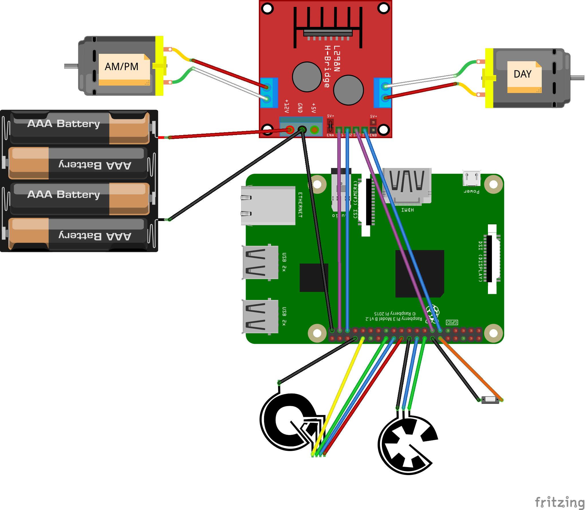

# flipclock

I got a vintage flip clock some time ago. It is sold under the name of FARTECH or Karlsson and has a round analog clock together with 3 flip displays. One contains the name of the month, the second display shows the current day and the third shows the name of the day together with an AM/PM indicator.

I disassembled the clock and connected the individual motors of the clock to a raspberry pi.

A small python program is controlling the rotation of the day number and the day name display. The month is currently not rotated automatically.
